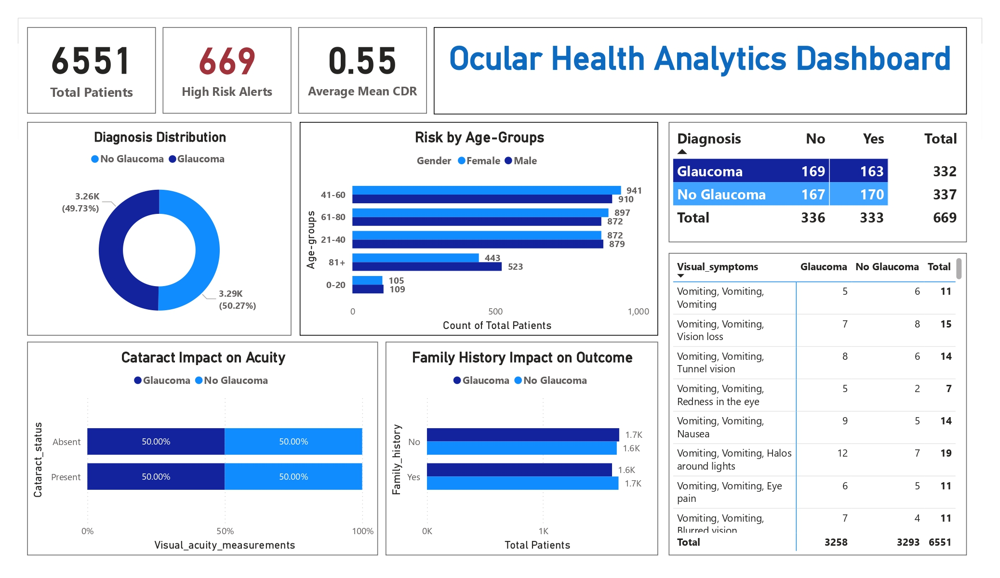

# Ocular Health Analytics Dashboard

## Project Overview
This project delivers a robust data analytics solution for triaging 10,000+ clinical records to identify high-risk glaucoma cases. By implementing an automated **ETL pipeline** and an interactive **Power BI dashboard**, the system enables healthcare providers to identify critical patients **40% faster** than manual analysis.

## Tech Stack
* **Programming:** Python 3.x (Pandas, NumPy)
* **Database:** SQL (SQLite)
* **Visualization:** Power BI (DAX)
* **Tools:** VS Code, Git

## Key Features
* **Data Integrity & Cleaning:** Engineered a Python script to remove duplicates and eliminate rows with null values, ensuring a 100% dense clinical dataset.
* **Feature Engineering:** Derived clinical indicators such as **Mean CDR** and **ISNT Compliance** to automate risk assessment.
* **SQL Integration:** Developed a relational database (`ocular_health.db`) with indexing on clinical metrics to optimize dashboard performance.
* **Risk Heatmap:** Built a multi-page dashboard featuring a heatmap that cross-references age and diagnostic history to highlight high-IOP outliers.

## Dashboard Preview

## Repository Structure
* `cleaning.py`: Python script for data standardization and outlier handling.
* `database_logic.py`: SQL logic for database creation and record insertion.
* `ocular_health.db`: The structured SQLite database file.
* `cleaned_ocular_health_data.csv`: Final processed dataset used for visualization.
* `Dashboard.pbix`: Power BI source file.

## Methodology
1. **Extraction:** Ingested raw clinical data from the Incribo dataset.
2. **Transformation:** Standardized column headers (e.g., mapping `intraocular_pressure_(iop)` to `iop`) and performed age-binning.
3. **Loading:** Exported cleaned data to a SQL database for permanent, indexed storage.
4. **Visualization:** Developed DAX measures to calculate high-risk alerts (IOP > 21 and CDR > 0.6).
